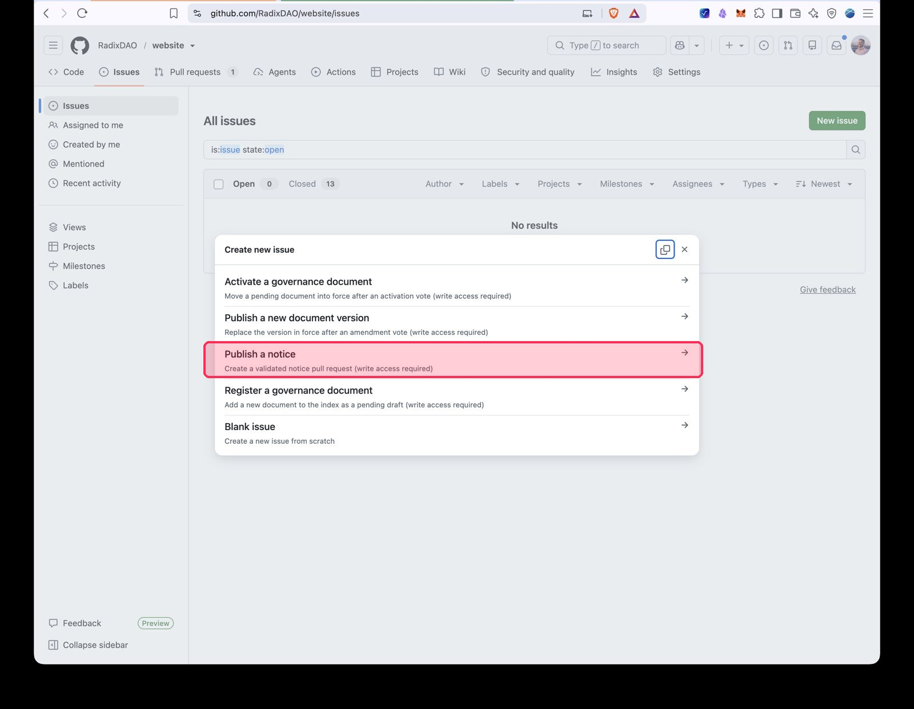
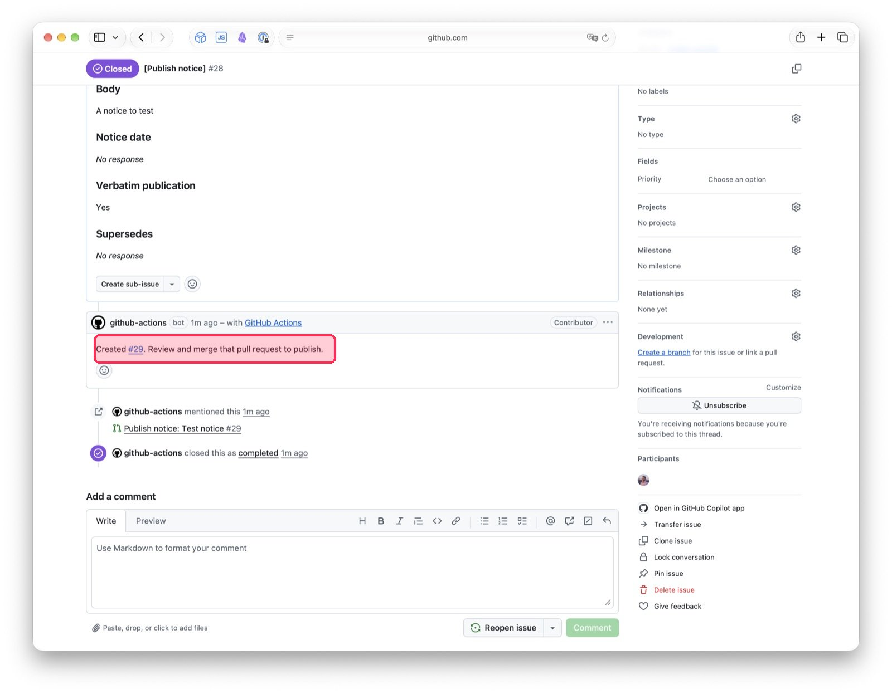
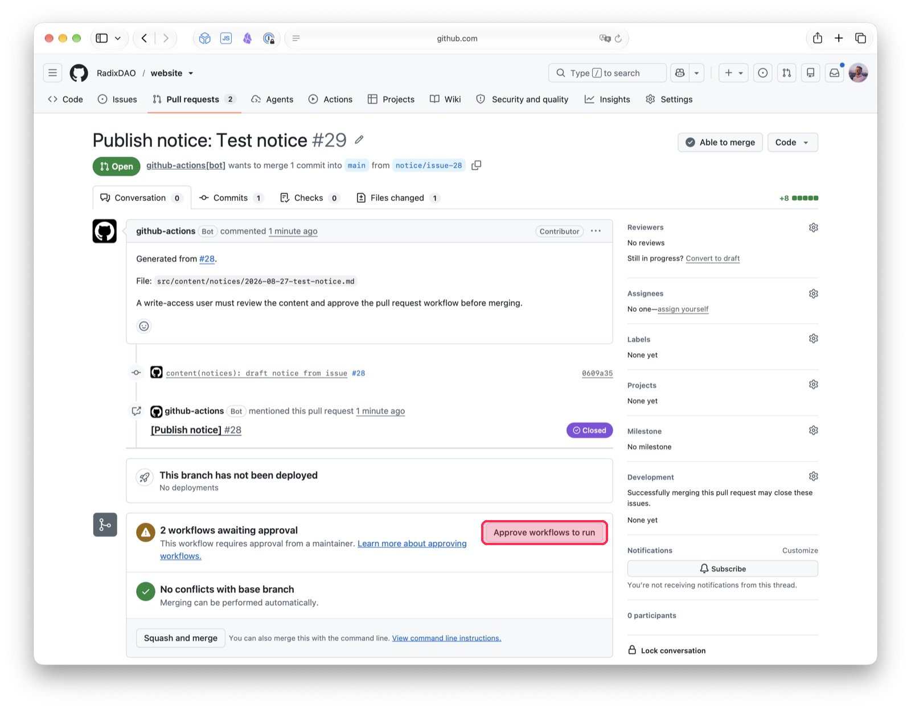
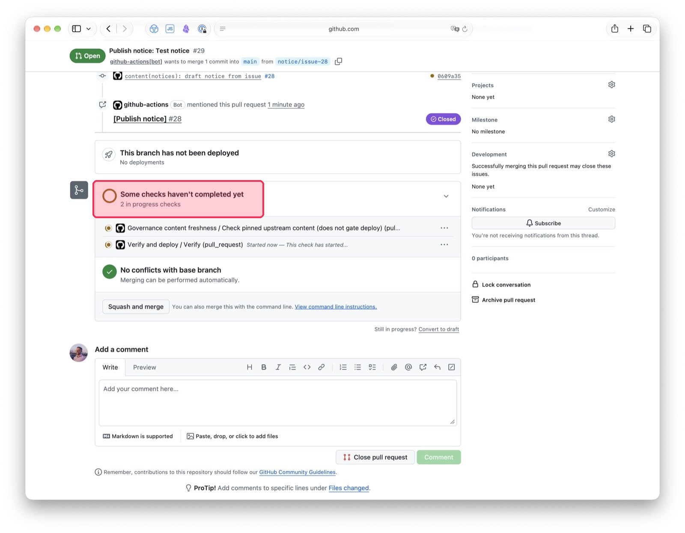
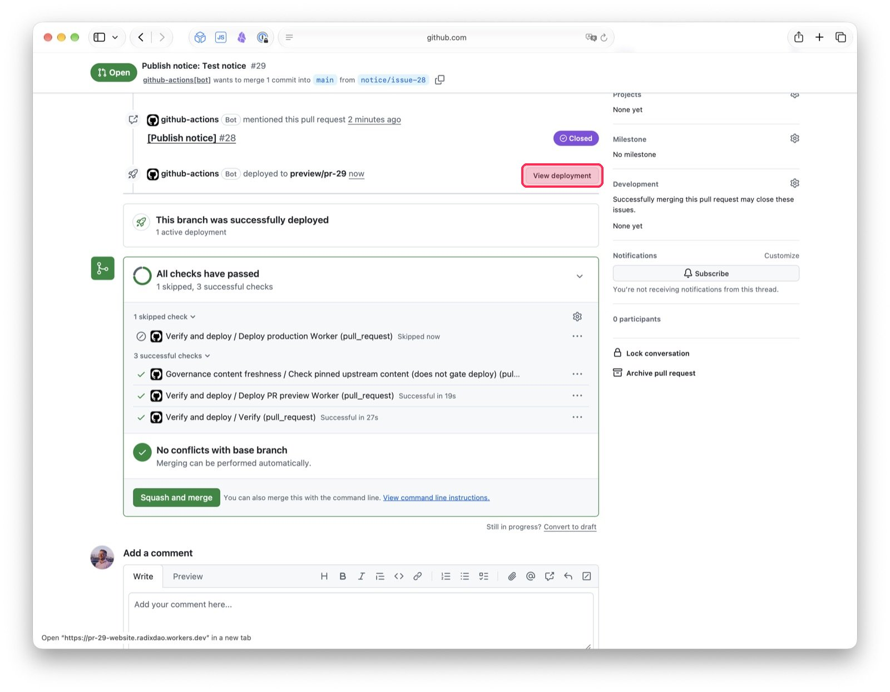
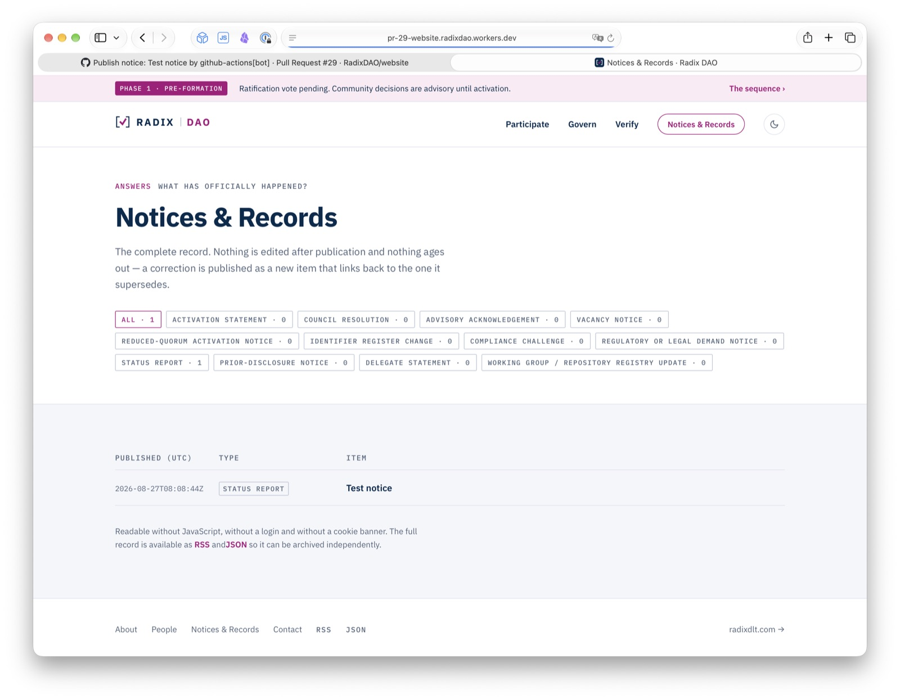
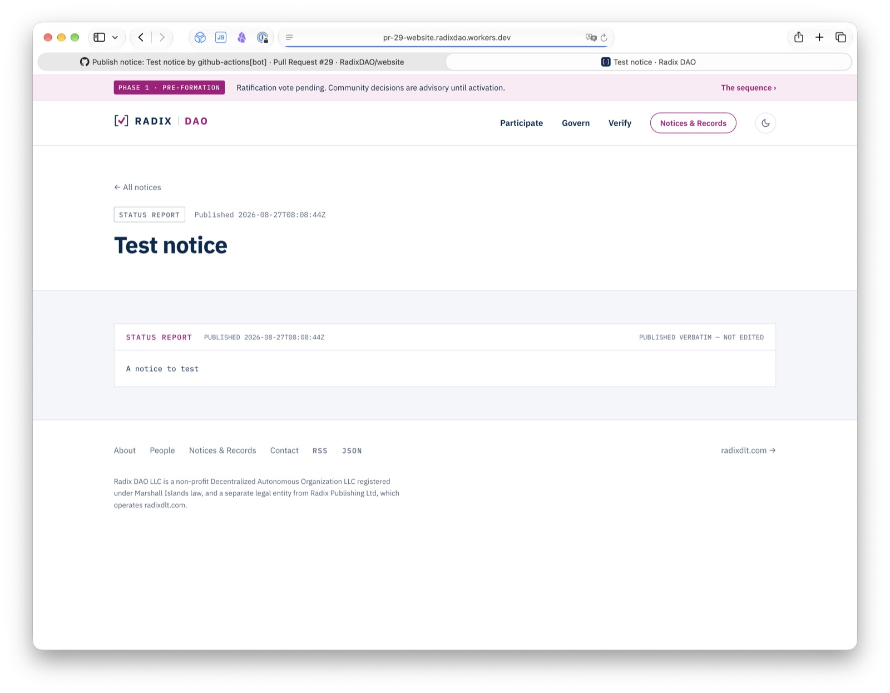
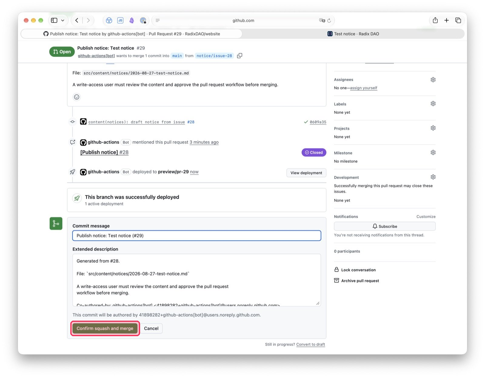
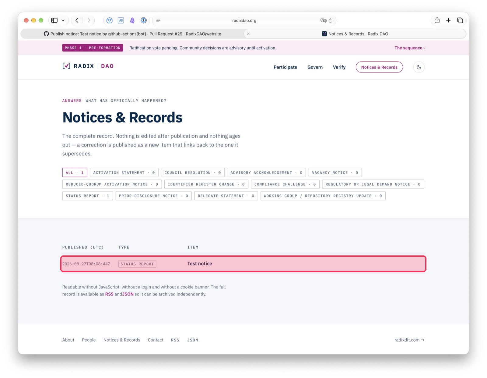

# Publishing a notice — a walkthrough for non-technical users

This guide walks through publishing a notice on radixdao.org using the GitHub form. No coding
knowledge is required, but you do need **write, maintain, or admin access** to the `RadixDAO/website`
repository on GitHub — the same person who writes the notice does every step below, start to finish.
If you're not sure whether you have that access, ask a maintainer to grant it.

**The single most important thing to know before you start:** every step after you submit the form
is handled automatically by GitHub Actions robots, not by you clicking more buttons. Each robot step
can take anywhere from a few seconds to a few minutes. **Don't panic and don't retry** if a page
looks like nothing is happening — scroll to find the checks/status section and wait for it to finish
before doing anything else. The whole process, start to a live page on radixdao.org, normally takes
somewhere between 5 and 15 minutes.

---

## Overview: the five stages

1. You fill in a form on GitHub describing the notice.
2. **A robot turns your form into a pull request (PR).** ⏳ Wait ~30–60 seconds.
3. **You approve the PR's automated checks to run**, then wait for them to finish. ⏳ A few minutes.
4. You review the generated notice and click **Squash and merge**.
5. **Robots build and deploy the site.** ⏳ A few more minutes, then the notice is live.

You act in steps 1, 3, and 4 — the same person throughout, no handoff to anyone else required. Steps
2 and 5 are the robots working — your job there is to wait and watch, not to act.

---

## Step 1 — Open the notice form

1. Go to the repository's **Issues** tab: `https://github.com/RadixDAO/website/issues`
2. Click the green **New issue** button.
3. From the list of templates, choose **Publish a notice** ("Create a validated notice pull request
   — write access required").

   > If you don't see this option, or GitHub says you don't have permission, you don't have write
   > access to the repository yet — ask a maintainer to grant it, or to publish the notice for you.

## Step 2 — Fill in the form

The form has these fields. Fill them in carefully — the content is copied through exactly as you
type it, so check it before submitting.

| Field | What to put |
|---|---|
| **Notice type** | One of six categories — see the table below the form fields for what lands in each. |
| **Notice title** | The exact title of the notice, as it should appear on the site. |
| **Body** | The full text of the notice, in Markdown. It is copied **without trimming or reflowing** — write it exactly as you want it published. |
| **Notice date** *(optional)* | Only fill this in if the notice has a statutory notice period with a specific UTC timestamp, formatted like `2026-08-11T14:30:00Z`. Leave blank otherwise. |
| **Verbatim publication** | Choose **Yes** only if the body must be rendered exactly as submitted, character for character. Otherwise choose **No**. |
| **Supersedes** *(optional)* | If this notice corrects an earlier one, put that notice's filename here, without the `.md` extension (e.g. `2026-08-01-example-resolution`). Leave blank otherwise. |

### Choosing the notice type

The dropdown has six categories. They are broad on purpose, so you should never have to agonise
between two similar-sounding labels — find the row that names your item and pick that one.

| Category | What lands in it |
|---|---|
| **Resolutions & decisions** | Council resolutions, routine decisions, function allocations, the Activation Statement |
| **Reports & records** | Minutes of meetings, status reports, quarterly accountability reports, post-deployment reports |
| **Process notices** | Reduced-quorum activations, advisory acknowledgements, vote result determinations, pre-action and advance notices, compliance challenge publications |
| **Roles & seats** | Vacancy notices, seatings, resignations, delegate statements |
| **Registry updates** | Identifier register, repository registry, Working Group registry |
| **Legal & compliance** | Regulatory and legal demand notices, emergency action disclosures |

The category does not change what a notice means or does — it only groups the record so a reader
can find things. If two categories seem to fit, pick either; it is not a decision that can go
wrong in a way that matters.

GitHub will remind you: **this form opens a pull request — it does not publish immediately.** That's
expected; that's stage 2 below.

Click **Create** at the bottom.

## Step 3 — The robot creates a pull request (wait ~30–60 seconds)

After you click Create, GitHub opens your new issue. Within about a minute, a bot account
(`github-actions`) will:

- Comment on your issue with a line like *"Created #29. Review and merge that pull request to
  publish."*
- Automatically close your issue as completed.

Click the **#29** link (highlighted above) in that comment to go to the new pull request. This PR
contains the actual notice file the robot generated from your form.

> If the issue closes **without** that comment, and instead says notice automation requires write
> access, it means the submitter doesn't have write/maintain/admin permission — ask a maintainer to
> grant access or to publish the notice on your behalf.

## Step 4 — Approve the workflow checks (wait a few minutes)

A brand-new pull request from a bot needs someone with write access to approve its automated checks
before they run. That's you — on the pull request page you'll see a banner:

> **2 workflows awaiting approval** — This workflow requires approval from a maintainer.

Click **Approve workflows to run**. GitHub will then start running validation and preview-deploy
checks, and the banner changes to something like:

> **Some checks haven't completed yet** — 2 in progress checks

**This is the step where waiting matters most.** Do not close the tab, do not click merge, and don't
worry if it takes a couple of minutes — content validation and a preview deployment are running in
the background. Refresh the page occasionally if you like; there's nothing else to click.

## Step 5 — Checks pass and a preview deploys

Once everything finishes, the page updates to:

> **All checks have passed** — 1 skipped, 3 successful checks
>
> **This branch was successfully deployed** — 1 active deployment

Before merging, it's worth clicking **View deployment** to preview exactly what the notice will look
like once it's live — this preview site is a full working copy of the real site with just your
change on it.

Read it over. If something's wrong, don't merge — you can edit the file yourself on the PR's "Files
changed" tab, or close the PR and start over from Step 1 with corrected text.

## Step 6 — Merge the pull request

If everything looks right, click **Squash and merge**, then **Confirm squash and merge** in the
dialog that appears.

> Notices are permanent once published: "Nothing is edited after publication and nothing ages out —
> a correction is published as a new item that links back to the one it supersedes." Only merge once
> you're confident the content is final.

## Step 7 — Production deploy (wait a few more minutes)

Merging kicks off one more round of robots: the change is built and deployed to the real production
site. This is separate from the preview deploy in Step 5 and takes its own few minutes. There's
nothing to click here either — just wait.

You can watch progress on the repository's **Actions** tab if you're curious, but it isn't required.

## Step 8 — Confirm it's live

Once the production deploy finishes, visit `https://radixdao.org/notices` (or wherever "Notices &
Records" is linked from the site's main navigation) and confirm your notice appears with the correct
publish timestamp.

That's it — the notice is now part of the permanent public record.

---

## Quick troubleshooting

- **"Notice automation requires write, maintain, or admin access"** — the person who submitted the
  form doesn't have the right repository permission. A maintainer needs to grant it, or publish on
  their behalf.
- **The PR sits with a yellow/orange "in progress" checks indicator for a long time** — this is
  normal for a few minutes. If it's been stuck for more than ~10 minutes, check the repository's
  **Actions** tab for a failed run, or ask a maintainer to look.
- **Content is wrong after you already submitted the form** — don't merge the PR. Either edit the
  file directly on the PR before merging, or close the PR/issue and start over from Step 1.
- **Time-critical situation (e.g. a compliance challenge that can't wait for the form)** — this
  guide's form flow is not for that. Use the documented manual publishing path instead (ask a
  maintainer).
